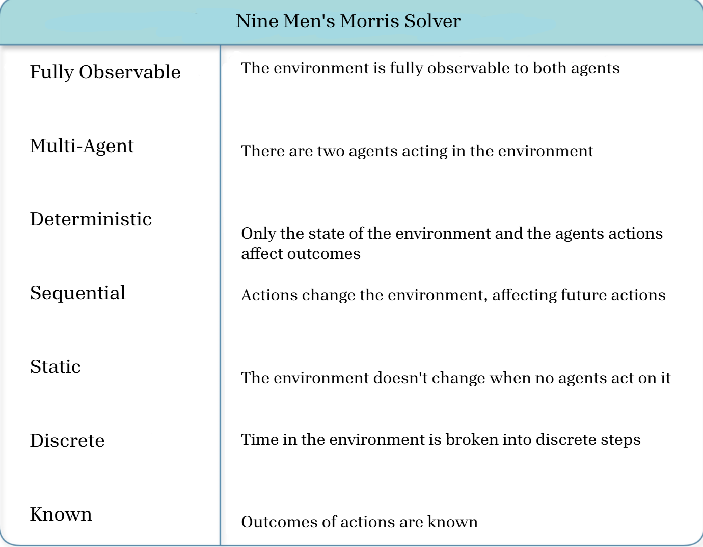

**Requirements**

Add images to this folder so we can eventually add it to the drive

- References
  - [Project 1](https://docs.google.com/document/d/18yjuf6_u7FrdDD5El6dm0gQjciRBoqCNS2pqEc45X1E/edit?usp=sharing)
  - [Project 2](https://docs.google.com/document/d/14q9LlTMxdtRLbnDi2xUTHpx3G7e0w8Clx0i63cAe3_k/edit?usp=sharing)

Video and code is extra credit, not too hard to work with either

# Title Page (separate nicely formatted page)

- Copy paste from previous [reports](https://docs.google.com/document/d/14q9LlTMxdtRLbnDi2xUTHpx3G7e0w8Clx0i63cAe3_k/edit?usp=sharing)

# Table of contents

- We've never done this before, intruiging: Best for last, TOC is easiest when everything already exists

# Abstract (Kevin)

- Writing

# Introduction (Kevin)

- Discuss the project, introduce the problem you are trying to solve, how you solve it, and sumarize your conclusions.
- Keywords

# Background (Kevin)

- Discuss the background of the problem you’re trying to solve.
- Discuss the background of your solution.

# Problem Formulation (Israel)

- Go over the complete formulation of your problem. This can be broken into subsections:
  - task environment,
    - The task environment is the specific context that an intelligent agent works within. It has defining characteristics that inform the type of agent that will be built to solve the problem. The properties of the Nine Men's Morris Solver task environment are listed below (Fig. **ADD A NUMBER HERE**).
    - 
  - PEAS,
  - goal formulation,
  - problem formulation,
  - etc.
  - Algorithm: include pseudo code of the algorithm you use. There are LaTeX libraries for formatting pseudo code.
- Each project will be different depending on the methods that you use so be sure to include all relevant details for your particular methods.
- In each subsection, include figures such as UML diagrams, flow charts, etc. to help your reader understand your solution method. You must discuss the problem solving performance
    - completeness,
    - optimality,
    - time complexity,
    - and space complexity.
- Discuss the meaning of each.

# Project Results (Israel)

- Describe the expected project results.

# Contributions (Israel)

- This section should be used to list all individual contributions of every group member. It should be clear what everyone worked on.

# Conclusion (Israel)

- More writing

---

The report needs to be written as a two-column IEEE standard paper. There will be a template on Canvas with LaTeX code with all sections. If you do not like using LaTeX, you can create the same style in Word or Google Docs. All images need to be labeled as figures and numbered. There should be absolutely no hand-drawn or handwritten elements of the paper. All figures should be clear and look professional. All citations need to be done using IEEE standard format.